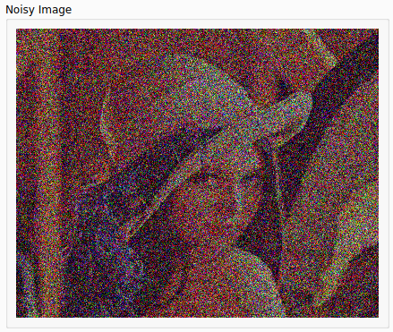
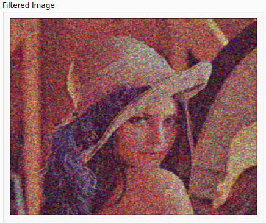
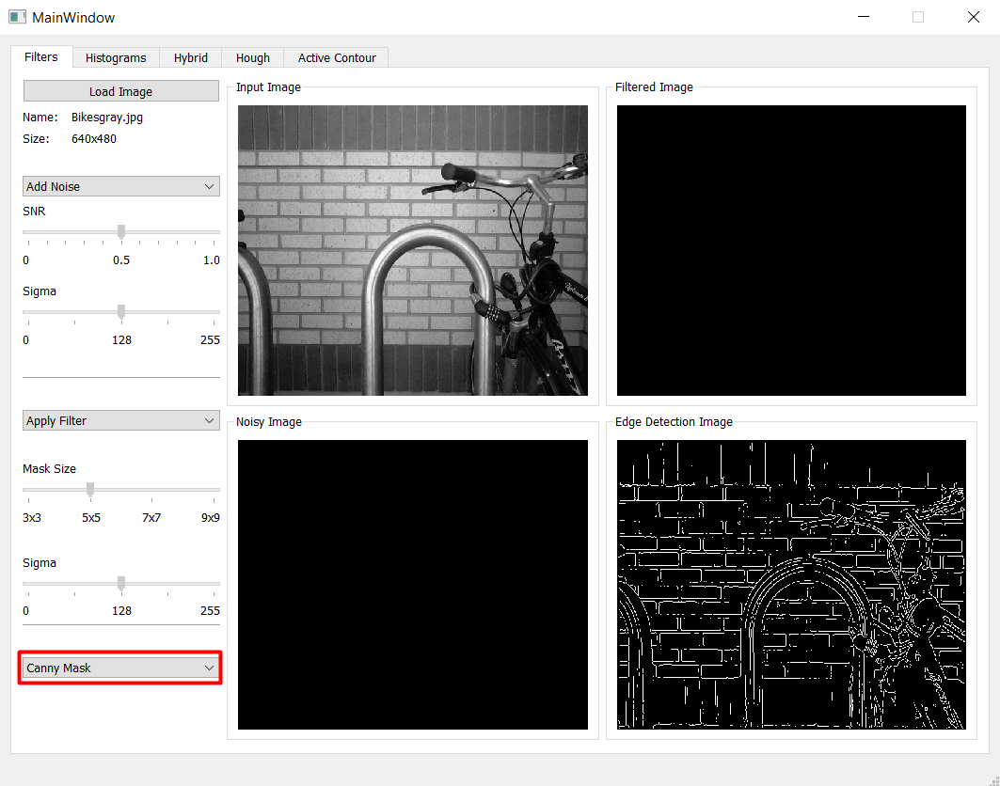
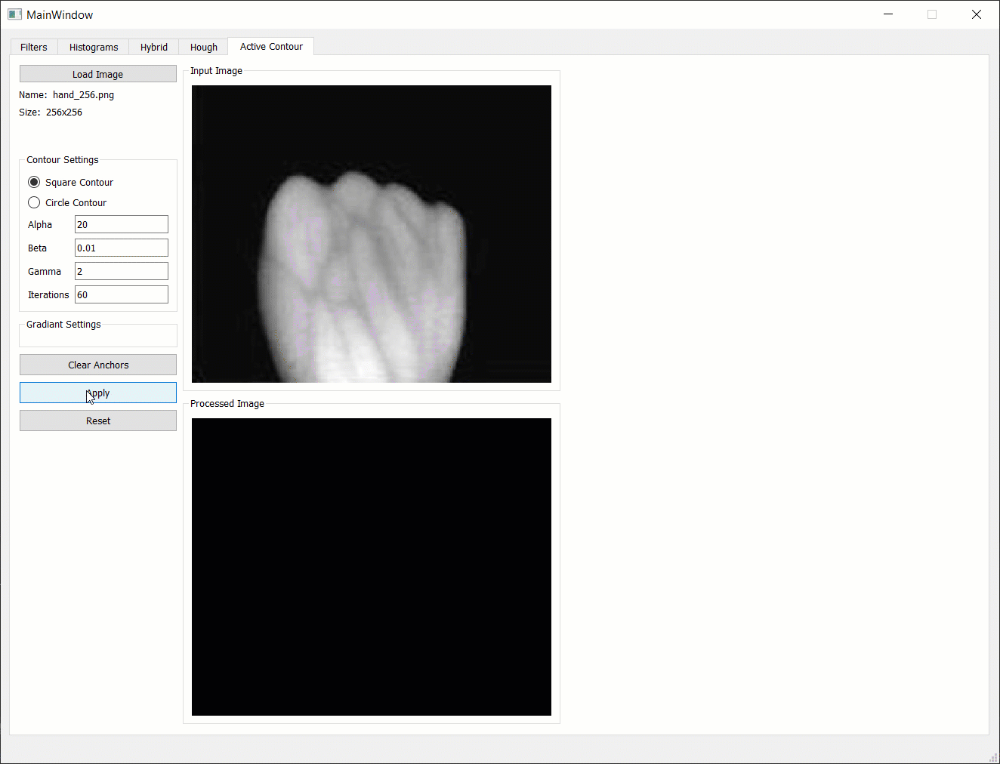
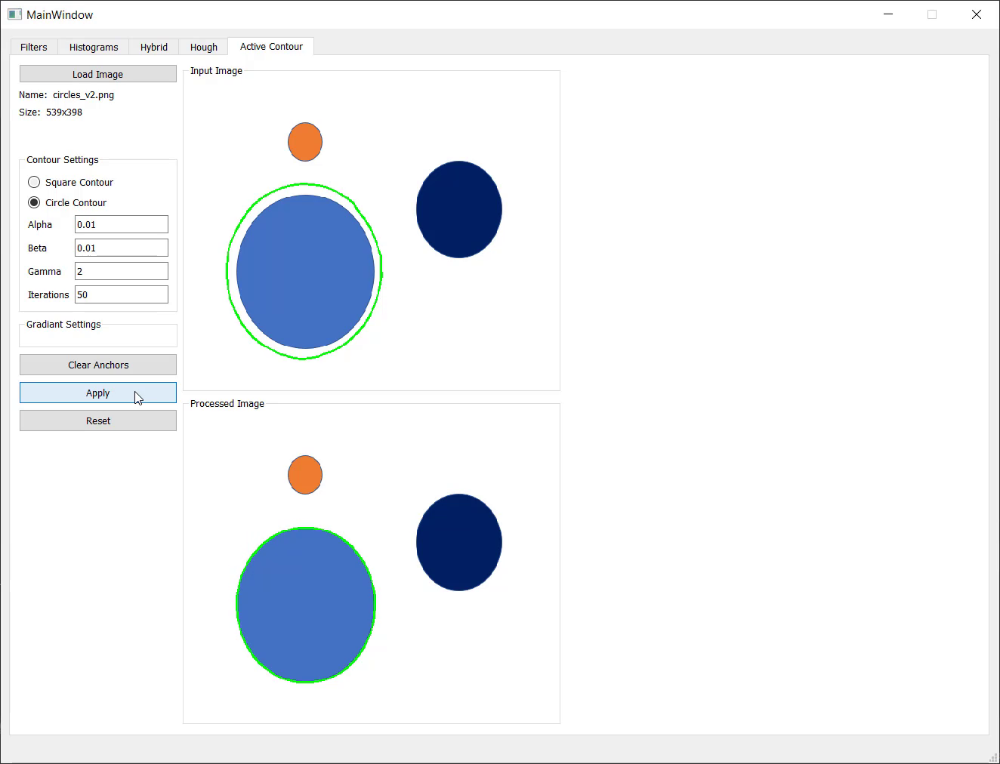
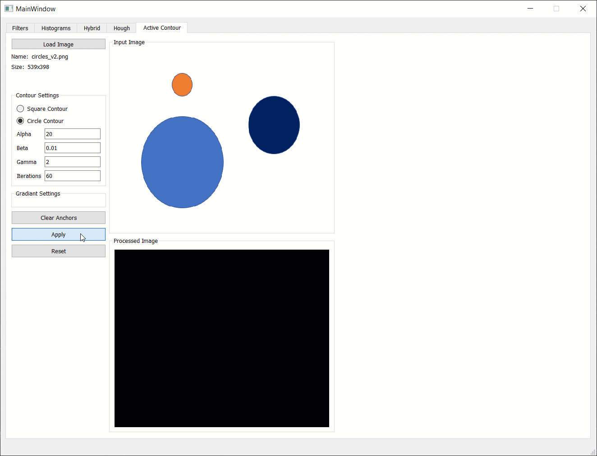

<h1 style="text-align: center;"> Computer Vision Tasks</h1>

| Name                    | Section | B.N Number   |
|-------------------------|---------|--------------|
| Ahmed Salah El-Dein     | 1       |            5 |
| Ahmad Abdelmageed Ahmad | 1       |            8 |
| Ahmad Mahdy Mohammed    | 1       |            9 |
| Abdullah Mohammed Sabry | 2       |            7 |

 

This repository is created by 

In this Repository we present a variety of Image processing Techniques implemented from scratch using `Python` programming language with Numpy and Pure Python. Each Category of Algorithms is presented in its tab in the UI which we will discover next.

Our UI present a tab for each category of the implemented algorithms. We first load our image and apply the selected algorithm.

## Table of contents
### <a href="#1-image-processing">1. Image Processing</a>
<!--### [1. Image Processing](#1-image-processing)-->
* [1.1 Adding Noise To an Image](#adding-noise-to-an-image)
* [1.2 Image Filtering](#-Image-Filtering)
* [1.3 Edge Detection Using Various Masks](#Edge-Detection-Using-Various-Masks)
* [1.4 Image Histogram and Thresholding](#Image-Histogram-and-Thresholding)
* [1.5 Hybrid Images](#Hybrid-Images)

### [2. Boundary Detection](#Boundary-Detection)
* [2.1 Hough Transformation (Lines and Circles Detection)](#Hough-Transformation)
* [2.2 Active Contour Model (Snake)](#Active-Contour)

### [3. Features Detection and Image Matching](#Features-Detection-and-Image-Matching)
* [3.1 Extract the unique features in all images using Harris operator](#Harris-Operator)
* [3.2 Generate feature descriptors using scale invariant features (SIFT)](#SIFT)
* [3.3 Match the image set features using sum of squared differences (SSD) and normalized cross correlations](#Image-Matching)

<!-- Task #1 Readme -->

# 1. Image Processing
## Adding Noise To an Image
We implemented 3 types of noise: `Uniform`, `Gaussian` and `Salt & Pepper` Noise. 
 
## Implementations Added:

1. Noise Functions (Simulation of Different Noise Types): Uniform, Gaussian and Salt & Pepper.
2. Edge Detection Techniques:  Prewitt, Sobel and Roberts.
3. Image Histogram Equalization and Normalization.
4. Local and Global Thresholding 
5. Transformation to Gray Scale
6. Frequency Domain Filters: Low Pass and High Pass Filters

In addition to histogram and distribution curve drawing for the loaded image and the option to mix 2 input images.

## Results:

#### 1. Noise Addition: 

##### 1.1 Uniform Noise

##### 1.2 Gaussian Noise

##### 1.3 Salt & Pepper Noise

#### 2. Noise Filtration:

##### 2.1 Average Filter (Applied on Gaussian Noise)

##### 2.2 Gaussian Filter (Applied on Gaussian Noise)

##### 2.3. Median Filter (Applied on a Salt & Pepper Noisy Image)

#### 3. Edge Detection Techniques:

##### 3.1 Sobel

##### 3.2 Prewitt

##### 3.3 Roberts

##### 3.4 Canny

You can apply different SNR ratios and choose the Sigma of Each Algorithm implemented from the sliders added on the left, each cell is marked with its contents and the application of the change in the sliders is instant.

#### 4. Histogram Equalization with input and output histograms

#### 5. Local and Global Thresholding

#### 6. Gray Scale Transformation

#### 7. Frequency Domain Mixing

   
   

# Edge and Boundary Detection

## Table of content
##### 1. Edge Detection Using Canny Mask
##### 2. Hough Transformation (Lines and Circles Detection)
##### 3. Active Contour Model (Snake)

### Edge Detection Using Canny Edge Detector
The Canny edge detector is an edge detection operator that uses a multi-stage algorithm to detect a wide range of edges in images.

### Hough Transformation
The Hough transform is a technique that locates shapes in images. In particular, it has been used to extract lines, circles and ellipses if you can represent that shape in mathematical form.

#### Line Detection

#### Circles Detection

### Active Contour Model (Using Greedy Algorithm)
Active contour is one of the active models in segmentation techniques, which makes use of the energy constraints and forces in the image for separation of region of interest.

Active contour defines a separate boundary or curvature for the regions of target object for segmentation.

#### Result of applying the algorithm on hand image

##### This GIF shows the process in a better way

#### Result of applying the algorithm on hand image

##### This GIF shows the process in a better way

# Features Detection and Image Matching

## Table of content
##### 1. Extract the unique features in all images using Harris operator
##### 2. Generate feature descriptors using scale invariant features (SIFT)
##### 3. Match the image set features using sum of squared differences (SSD) and normalized cross correlations

**Each Algorithm Applied was thrown onto a thread for faster better experience**
### Extract the unique features in all images using Harris operator
**Applying a threshold 0.2 it only took about 0.01 second to detect all Image Corners**

**We also applied the harris operator on a harder image with the same threshold this time it only took 0.02 seconds** 

)

### Using Sift Descriptors and Harris Operator to Match the image set features 
**Using Harris Operator to Detect Image Key Points and Applying the SIFT Algorithm to Generate each Feature Descriptor,
Applying Two Matching Algorithms SSD And NCC**

### using sum of squared differences (SSD)

### Using Normalized Cross Correlations (NCC)

