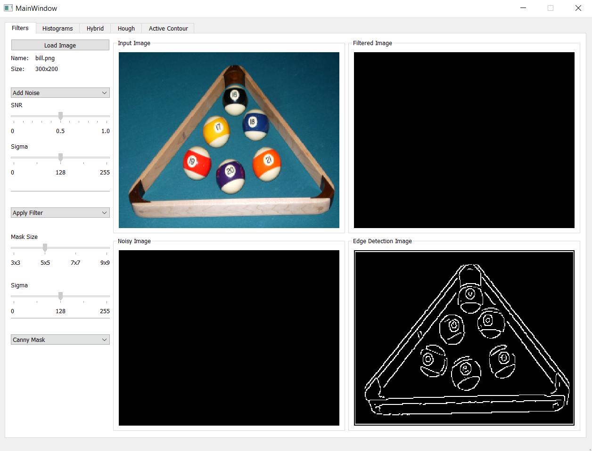
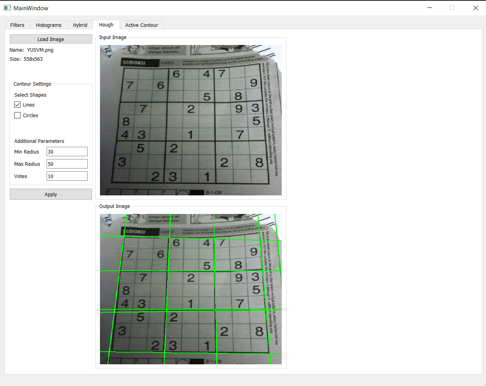
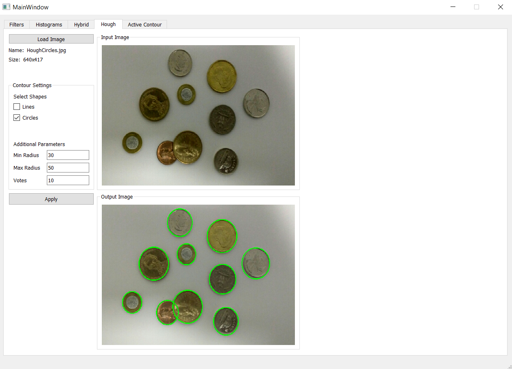
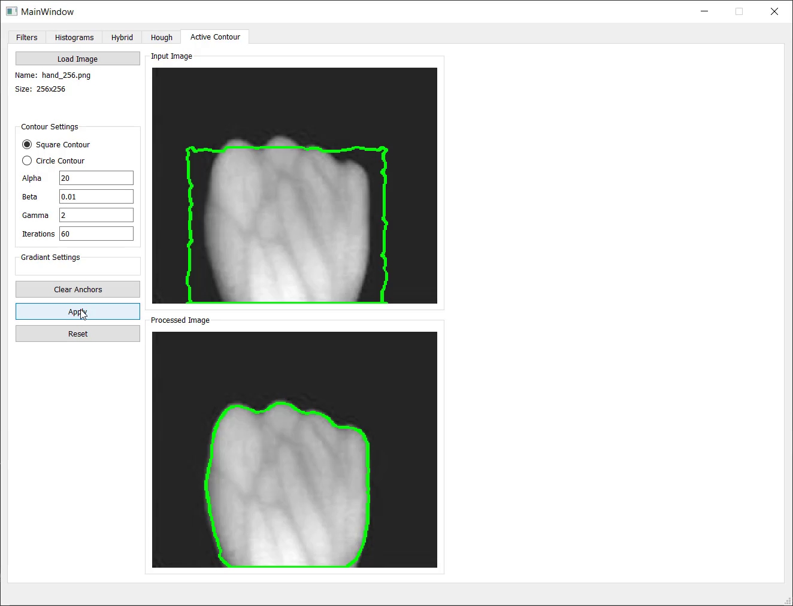

<h1 style="text-align: center;"> Edge and Boundary Detection</h1>
<h3 style="text-align: center;"> Submitted to: Dr. Ahmed Badawi</h3>
<h3 style="text-align: center;"> 2020 - 2021</h3>

| Name                    | Section | B.N Number   |
|-------------------------|---------|--------------|
| Ahmed Salah El-Dein     | 1       |            5 |
| Ahmad Abdelmageed Ahmad | 1       |            8 |
| Ahmad Mahdy Mohammed    | 1       |            9 |
| Abdullah Mohammed Sabry | 2       |            7 |

## Table of content
##### 1. Edge Detection Using Canny Mask
##### 2. Hough Transformation (Lines and Circles Detection)
##### 3. Active Contour Model (Snake)

### Edge Detection Using Canny Edge Detector
The Canny edge detector is an edge detection operator that uses a multi-stage algorithm to detect a wide range of edges in images.

### Hough Transformation
The Hough transform is a technique that locates shapes in images. In particular, it has been used to extract lines, circles and ellipses if you can represent that shape in mathematical form.

#### Line Detection

#### Circles Detection

### Active Contour Model (Using Greedy Algorithm)
Active contour is one of the active models in segmentation techniques, which makes use of the energy constraints and forces in the image for separation of region of interest.

Active contour defines a separate boundary or curvature for the regions of target object for segmentation.

#### Result of applying the algorithm on hand image

##### This GIF shows the process in a better way

#### Result of applying the algorithm on hand image

##### This GIF shows the process in a better way

